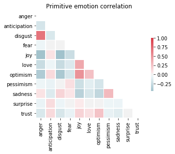
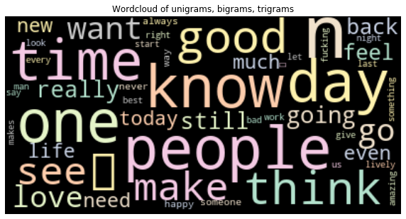
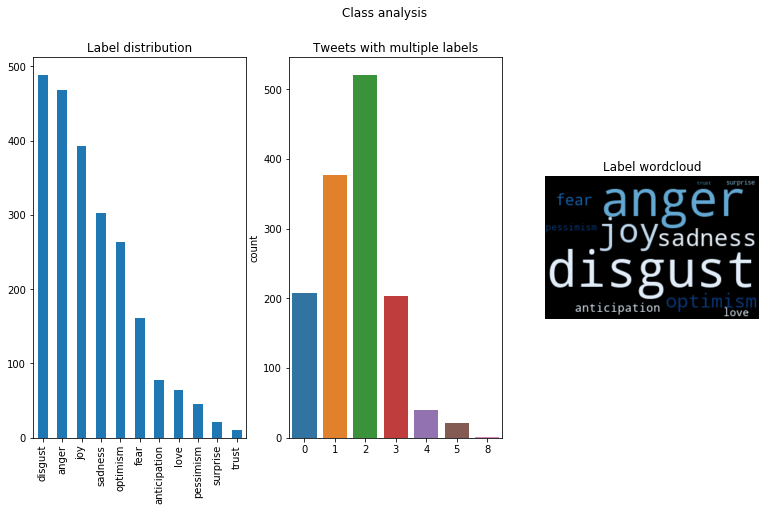
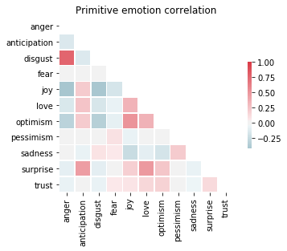
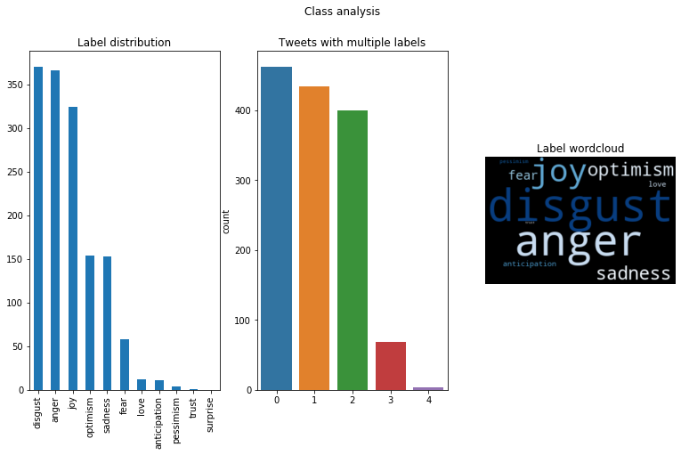
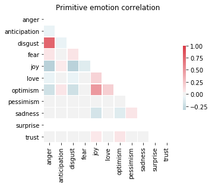

<style scoped>
    .dataframe tbody tr th:only-of-type {
        vertical-align: middle;
    }

    .dataframe tbody tr th {
        vertical-align: top;
    }

    .dataframe thead th {
        text-align: right;
    }
</style>
<table border="1" class="dataframe">
  <thead>
    <tr style="text-align: right;">
      <th></th>
      <th>ID</th>
      <th>Tweet</th>
      <th>anger</th>
      <th>anticipation</th>
      <th>disgust</th>
      <th>fear</th>
      <th>joy</th>
      <th>love</th>
      <th>optimism</th>
      <th>pessimism</th>
      <th>sadness</th>
      <th>surprise</th>
      <th>trust</th>
    </tr>
  </thead>
  <tbody>
    <tr>
      <td>0</td>
      <td>2017-En-21441</td>
      <td>“Worry is a down payment on a problem you may ...</td>
      <td>0</td>
      <td>1</td>
      <td>0</td>
      <td>0</td>
      <td>0</td>
      <td>0</td>
      <td>1</td>
      <td>0</td>
      <td>0</td>
      <td>0</td>
      <td>1</td>
    </tr>
    <tr>
      <td>1</td>
      <td>2017-En-31535</td>
      <td>Whatever you decide to do make sure it makes y...</td>
      <td>0</td>
      <td>0</td>
      <td>0</td>
      <td>0</td>
      <td>1</td>
      <td>1</td>
      <td>1</td>
      <td>0</td>
      <td>0</td>
      <td>0</td>
      <td>0</td>
    </tr>
    <tr>
      <td>2</td>
      <td>2017-En-21068</td>
      <td>@Max_Kellerman  it also helps that the majorit...</td>
      <td>1</td>
      <td>0</td>
      <td>1</td>
      <td>0</td>
      <td>1</td>
      <td>0</td>
      <td>1</td>
      <td>0</td>
      <td>0</td>
      <td>0</td>
      <td>0</td>
    </tr>
    <tr>
      <td>3</td>
      <td>2017-En-31436</td>
      <td>Accept the challenges so that you can literall...</td>
      <td>0</td>
      <td>0</td>
      <td>0</td>
      <td>0</td>
      <td>1</td>
      <td>0</td>
      <td>1</td>
      <td>0</td>
      <td>0</td>
      <td>0</td>
      <td>0</td>
    </tr>
    <tr>
      <td>4</td>
      <td>2017-En-22195</td>
      <td>My roommate: it's okay that we can't spell bec...</td>
      <td>1</td>
      <td>0</td>
      <td>1</td>
      <td>0</td>
      <td>0</td>
      <td>0</td>
      <td>0</td>
      <td>0</td>
      <td>0</td>
      <td>0</td>
      <td>0</td>
    </tr>
  </tbody>
</table>
</div>


## Data exploration

Class distribution


```python
feelings = emo_train_df.columns[2:]#['anger', 'anticipation', 'disgust', 'fear', 'joy', 'love', 'optimism', 'pessimism', 'sadness', 'surprise', 'trust']
multilabel_visualization(emo_train_df[feelings].values, feelings)
```





Preprocessing:
* Tokenization
* Stopword removal
* Special character handling
* Emoji parsing
* Data cleaning


```python
emo_train_df['tokenized_features'] = emo_train_df['Tweet'].apply(tweet_processor.tweet_pipeline)

corpus = emo_train_df['tokenized_features'].apply(lambda x: ' '.join(x))
draw_wordcloud(corpus)
```





## Feature selection


```python
# Tweet preprocessing
emo_train_df['tokenized_features'] = emo_train_df['Tweet'].apply(tweet_processor.tweet_pipeline)
X = emo_train_df['tokenized_features'].apply(lambda x: ' '.join(x)).values

# TF-IDF text features
vectorizer = tweet_processor.tfidf_vectorizer(X)
X_tfidf = vectorizer.transform(X)

# TF-IDF emoji features
vectorizer = tweet_processor.emoji_vectorizer(X)
X_emoji = vectorizer.transform(X)

# LDA features
X_lda = tweet_processor.lda_features(X, len(feelings))

```

 Dataset split


```python
# Combine features
X_combined = np.hstack((X_tfidf.toarray(), X_emoji.toarray()))
y = emo_train_df[feelings].values
x_train_id, x_test_id, y_train, y_test = train_test_split(range(X_combined.shape[0]), y, test_size=0.2, random_state=0)
x_train, x_test = X_combined[x_train_id], X_combined[x_test_id]
x_train.shape, y_train.shape, x_test.shape
```


    ((5470, 5329), (5470, 11), (1368, 5329))


## Classification

One-vs-rest classification


```python
from sklearn.multiclass import OneVsRestClassifier
from sklearn.model_selection import GridSearchCV
from sklearn.naive_bayes import MultinomialNB, BernoulliNB
from sklearn.metrics import classification_report, confusion_matrix, accuracy_score
from sklearn import metrics
from sklearn.pipeline import Pipeline, make_pipeline


print("")
print("Starting classifier...")
print("")
start = datetime.now()

pipeline = Pipeline([
                ('clf', OneVsRestClassifier(BernoulliNB(class_prior=None)))
            ])

parameters = [{
            'clf__estimator__alpha': (0.5, 0.7, 1),
            }]

grid_search_cv = GridSearchCV(pipeline, 
                              parameters, 
                              cv=2,
                              verbose=2,
                              n_jobs=-1)
grid_search_cv.fit(x_train, y_train)
best_clf = grid_search_cv.best_estimator_

print('Finished training in : ', datetime.now()-start) 

y_pred = best_clf.predict(x_test)
start = datetime.now()
print(multilabel_evaluation(y_pred, y_test))
# print(best_clf.get_params())
print('Finished classification in : ', datetime.now()-start) 

```

    
    Starting classifier...
    
    Fitting 2 folds for each of 3 candidates, totalling 6 fits


    [Parallel(n_jobs=-1)]: Using backend LokyBackend with 12 concurrent workers.
    [Parallel(n_jobs=-1)]: Done   3 out of   6 | elapsed:    8.7s remaining:    8.7s
    [Parallel(n_jobs=-1)]: Done   6 out of   6 | elapsed:    9.0s finished


    Finished training in :  0:00:12.605913
    {'accuracy': 0.843, 'precision': 0.365, 'recall': 0.577, 'f1_score': 0.447, 'hamming_loss': 0.157}
    Finished classification in :  0:00:00.002919


```python
multilabel_visualization(y_pred, feelings)
```








```python
from sklearn.multiclass import OneVsRestClassifier
from sklearn.model_selection import GridSearchCV
from sklearn.naive_bayes import MultinomialNB, BernoulliNB
from sklearn.metrics import classification_report, confusion_matrix, accuracy_score
from sklearn import metrics
from sklearn.pipeline import Pipeline, make_pipeline

print("")
print("Starting OneVsRestClassifier MultinomialNB classifier...")
print("")
start = datetime.now()

parameters = [{
            'estimator__alpha': (0.5, 0.7, 1),
            }]

grid_search_cv = GridSearchCV(OneVsRestClassifier(MultinomialNB(class_prior=None)), 
                              parameters, 
                              cv=2,
                              verbose=1,
                             n_jobs=-1)
grid_search_cv.fit(x_train, y_train)
best_clf = grid_search_cv.best_estimator_

print('Finished training in : ', datetime.now()-start) 
start = datetime.now()
y_pred = best_clf.predict(x_test)
print(multilabel_evaluation(y_pred, y_test))
# print(best_clf.get_params())
print('Finished classification in : ', datetime.now()-start) 

```

    
    Starting OneVsRestClassifier MultinomialNB classifier...
    
    Fitting 2 folds for each of 3 candidates, totalling 6 fits


    [Parallel(n_jobs=-1)]: Using backend LokyBackend with 12 concurrent workers.
    [Parallel(n_jobs=-1)]: Done   4 out of   6 | elapsed:    2.8s remaining:    1.4s
    [Parallel(n_jobs=-1)]: Done   6 out of   6 | elapsed:    2.9s finished


    Finished training in :  0:00:03.386755
    {'accuracy': 0.841, 'precision': 0.235, 'recall': 0.69, 'f1_score': 0.351, 'hamming_loss': 0.159}
    Finished classification in :  0:00:00.066956


```python
multilabel_visualization(y_pred, feelings)
```








```python
print('Finished training in : ', datetime.now()-start_all)
```

    Finished training in :  0:00:34.530155


# TODO

1. New evaluation metric: distance of emotion correlation between train and test set
2. ROC evaluation

~~3. Check TextBlob NB classifier~~

4. Check other features from TweetProcessor module

~~5. Check LDA features~~

~~6. 2,3grams wordcloud~~

---
7. Deal with class impalance
8. Other multiclass methods apart from One-vs-rest
9. Deal with uncertainty
